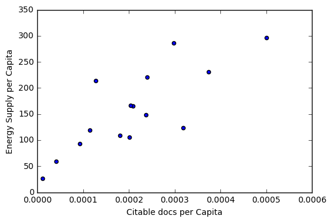
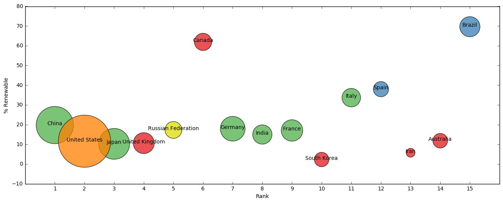

# Energy-and-Technology
By: Anh Dang
This project is to apply Python to analyze information from different datasets to gain the insights about energy consumption, GDP in Top 15 countries with the most advanced energy engineering and technologies

### 1. Get and Merge Data
Merge `Energy Indicators.xls`, which is a list of indicators of [energy supply and renewable electricity production](Energy%20Indicators.xls) from the [United Nations](http://unstats.un.org/unsd/environment/excel_file_tables/2013/Energy%20Indicators.xls) for the year 2013, the GDP data from the file `world_bank.csv`, which is a csv containing countries' GDP from 1960 to 2015 from [World Bank](http://data.worldbank.org/indicator/NY.GDP.MKTP.CD) and the [Sciamgo Journal and Country Rank data for Energy Engineering and Power Technology](http://www.scimagojr.com/countryrank.php?category=2102) from the file `scimagojr-3.xlsx`, which ranks countries based on their journal contributions in the aforementioned area. 

Use only the last 10 years (2006-2015) of GDP data and only the top 15 countries by Scimagojr 'Rank' (Rank 1 through 15). 

The index of this DataFrame should be the name of the country, and the columns should be ['Rank', 'Documents', 'Citable documents', 'Citations', 'Self-citations',
       'Citations per document', 'H index', 'Energy Supply',
       'Energy Supply per Capita', '% Renewable', '2006', '2007', '2008',
       '2009', '2010', '2011', '2012', '2013', '2014', '2015'].


```python
def clean_data():
    import pandas as pd
    import numpy as np

    # reading data of energy
    energy = (pd.read_excel("Energy Indicators.xls", header=17, skip_footer=38, parse_cols="C:G")
                .reset_index()
                .replace('...', np.nan))  # replace '...'


    energy.columns = ['Country', 'Energy Supply', 'Energy Supply per Capita', '% Renewable'] # change col labels
    energy['Country'] = energy['Country'].str.replace('\d+','')  # replace digits in 'Country' col
    energy['Energy Supply'] = energy['Energy Supply'] * 1000000  # convert Energy Supply

    di = {"Republic of Korea": "South Korea",
          "United States of America": "United States",
          "United Kingdom of Great Britain and Northern Ireland": "United Kingdom",
          "China, Hong Kong Special Administrative Region": "Hong Kong"}

    energy = energy.replace({'Country':di})  # TRICK: Use the dict. to change values

    import os, re  # remove characters inside the parenthesis
    energy['Country'] = energy.apply(lambda x: re.sub(r' \([^()]*\)', '', x['Country']), axis=1)
    energy = energy.set_index('Country')
    
    # reading data of GDP
    di = {"Korea, Rep.": "South Korea", 
         "Iran, Islamic Rep.": "Iran",
         "Hong Kong SAR, China": "Hong Kong"}

    GDP = (pd.read_csv("world_bank.csv", header=4)
             .rename(columns={'Country Name': 'Country'})
             .replace({'Country': di})
             .set_index('Country')
             .loc[:, '2006':'2015'])
    
    # reading data of ScimEn
    ScimEn = pd.read_excel('scimagojr-3.xlsx', index_col = 'Country')
    ScimEn = ScimEn[ScimEn['Rank'] < 16]
    
    # merge data
    df_temp = pd.merge(ScimEn, energy, how='inner', left_index=True, right_index=True)
    df = pd.merge(df_temp, GDP, how='inner', left_index=True, right_index=True)  
   
    return df

clean_data()
```


<div>
<table border="1" class="dataframe">
  <thead>
    <tr style="text-align: right;">
      <th></th>
      <th>Rank</th>
      <th>Documents</th>
      <th>Citable documents</th>
      <th>Citations</th>
      <th>Self-citations</th>
      <th>Citations per document</th>
      <th>H index</th>
      <th>Energy Supply</th>
      <th>Energy Supply per Capita</th>
      <th>% Renewable</th>
      <th>2006</th>
      <th>2007</th>
      <th>2008</th>
      <th>2009</th>
      <th>2010</th>
      <th>2011</th>
      <th>2012</th>
      <th>2013</th>
      <th>2014</th>
      <th>2015</th>
    </tr>
    <tr>
      <th>Country</th>
      <th></th>
      <th></th>
      <th></th>
      <th></th>
      <th></th>
      <th></th>
      <th></th>
      <th></th>
      <th></th>
      <th></th>
      <th></th>
      <th></th>
      <th></th>
      <th></th>
      <th></th>
      <th></th>
      <th></th>
      <th></th>
      <th></th>
      <th></th>
    </tr>
  </thead>
  <tbody>
    <tr>
      <th>Australia</th>
      <td>14</td>
      <td>8831</td>
      <td>8725</td>
      <td>90765</td>
      <td>15606</td>
      <td>10.28</td>
      <td>107</td>
      <td>5.386000e+09</td>
      <td>231.0</td>
      <td>11.810810</td>
      <td>1.021939e+12</td>
      <td>1.060340e+12</td>
      <td>1.099644e+12</td>
      <td>1.119654e+12</td>
      <td>1.142251e+12</td>
      <td>1.169431e+12</td>
      <td>1.211913e+12</td>
      <td>1.241484e+12</td>
      <td>1.272520e+12</td>
      <td>1.301251e+12</td>
    </tr>
    <tr>
      <th>Brazil</th>
      <td>15</td>
      <td>8668</td>
      <td>8596</td>
      <td>60702</td>
      <td>14396</td>
      <td>7.00</td>
      <td>86</td>
      <td>1.214900e+10</td>
      <td>59.0</td>
      <td>69.648030</td>
      <td>1.845080e+12</td>
      <td>1.957118e+12</td>
      <td>2.056809e+12</td>
      <td>2.054215e+12</td>
      <td>2.208872e+12</td>
      <td>2.295245e+12</td>
      <td>2.339209e+12</td>
      <td>2.409740e+12</td>
      <td>2.412231e+12</td>
      <td>2.319423e+12</td>
    </tr>
    <tr>
      <th>Canada</th>
      <td>6</td>
      <td>17899</td>
      <td>17620</td>
      <td>215003</td>
      <td>40930</td>
      <td>12.01</td>
      <td>149</td>
      <td>1.043100e+10</td>
      <td>296.0</td>
      <td>61.945430</td>
      <td>1.564469e+12</td>
      <td>1.596740e+12</td>
      <td>1.612713e+12</td>
      <td>1.565145e+12</td>
      <td>1.613406e+12</td>
      <td>1.664087e+12</td>
      <td>1.693133e+12</td>
      <td>1.730688e+12</td>
      <td>1.773486e+12</td>
      <td>1.792609e+12</td>
    </tr>
    <tr>
      <th>China</th>
      <td>1</td>
      <td>127050</td>
      <td>126767</td>
      <td>597237</td>
      <td>411683</td>
      <td>4.70</td>
      <td>138</td>
      <td>1.271910e+11</td>
      <td>93.0</td>
      <td>19.754910</td>
      <td>3.992331e+12</td>
      <td>4.559041e+12</td>
      <td>4.997775e+12</td>
      <td>5.459247e+12</td>
      <td>6.039659e+12</td>
      <td>6.612490e+12</td>
      <td>7.124978e+12</td>
      <td>7.672448e+12</td>
      <td>8.230121e+12</td>
      <td>8.797999e+12</td>
    </tr>
    <tr>
      <th>Germany</th>
      <td>7</td>
      <td>17027</td>
      <td>16831</td>
      <td>140566</td>
      <td>27426</td>
      <td>8.26</td>
      <td>126</td>
      <td>1.326100e+10</td>
      <td>165.0</td>
      <td>17.901530</td>
      <td>3.332891e+12</td>
      <td>3.441561e+12</td>
      <td>3.478809e+12</td>
      <td>3.283340e+12</td>
      <td>3.417298e+12</td>
      <td>3.542371e+12</td>
      <td>3.556724e+12</td>
      <td>3.567317e+12</td>
      <td>3.624386e+12</td>
      <td>3.685556e+12</td>
    </tr>
    <tr>
      <th>Spain</th>
      <td>12</td>
      <td>9428</td>
      <td>9330</td>
      <td>123336</td>
      <td>23964</td>
      <td>13.08</td>
      <td>115</td>
      <td>4.923000e+09</td>
      <td>106.0</td>
      <td>37.968590</td>
      <td>1.414823e+12</td>
      <td>1.468146e+12</td>
      <td>1.484530e+12</td>
      <td>1.431475e+12</td>
      <td>1.431673e+12</td>
      <td>1.417355e+12</td>
      <td>1.380216e+12</td>
      <td>1.357139e+12</td>
      <td>1.375605e+12</td>
      <td>1.419821e+12</td>
    </tr>
    <tr>
      <th>France</th>
      <td>9</td>
      <td>13153</td>
      <td>12973</td>
      <td>130632</td>
      <td>28601</td>
      <td>9.93</td>
      <td>114</td>
      <td>1.059700e+10</td>
      <td>166.0</td>
      <td>17.020280</td>
      <td>2.607840e+12</td>
      <td>2.669424e+12</td>
      <td>2.674637e+12</td>
      <td>2.595967e+12</td>
      <td>2.646995e+12</td>
      <td>2.702032e+12</td>
      <td>2.706968e+12</td>
      <td>2.722567e+12</td>
      <td>2.729632e+12</td>
      <td>2.761185e+12</td>
    </tr>
    <tr>
      <th>United Kingdom</th>
      <td>4</td>
      <td>20944</td>
      <td>20357</td>
      <td>206091</td>
      <td>37874</td>
      <td>9.84</td>
      <td>139</td>
      <td>7.920000e+09</td>
      <td>124.0</td>
      <td>10.600470</td>
      <td>2.419631e+12</td>
      <td>2.482203e+12</td>
      <td>2.470614e+12</td>
      <td>2.367048e+12</td>
      <td>2.403504e+12</td>
      <td>2.450911e+12</td>
      <td>2.479809e+12</td>
      <td>2.533370e+12</td>
      <td>2.605643e+12</td>
      <td>2.666333e+12</td>
    </tr>
    <tr>
      <th>India</th>
      <td>8</td>
      <td>15005</td>
      <td>14841</td>
      <td>128763</td>
      <td>37209</td>
      <td>8.58</td>
      <td>115</td>
      <td>3.319500e+10</td>
      <td>26.0</td>
      <td>14.969080</td>
      <td>1.265894e+12</td>
      <td>1.374865e+12</td>
      <td>1.428361e+12</td>
      <td>1.549483e+12</td>
      <td>1.708459e+12</td>
      <td>1.821872e+12</td>
      <td>1.924235e+12</td>
      <td>2.051982e+12</td>
      <td>2.200617e+12</td>
      <td>2.367206e+12</td>
    </tr>
    <tr>
      <th>Iran</th>
      <td>13</td>
      <td>8896</td>
      <td>8819</td>
      <td>57470</td>
      <td>19125</td>
      <td>6.46</td>
      <td>72</td>
      <td>9.172000e+09</td>
      <td>119.0</td>
      <td>5.707721</td>
      <td>3.895523e+11</td>
      <td>4.250646e+11</td>
      <td>4.289909e+11</td>
      <td>4.389208e+11</td>
      <td>4.677902e+11</td>
      <td>4.853309e+11</td>
      <td>4.532569e+11</td>
      <td>4.445926e+11</td>
      <td>4.639027e+11</td>
      <td>NaN</td>
    </tr>
    <tr>
      <th>Italy</th>
      <td>11</td>
      <td>10964</td>
      <td>10794</td>
      <td>111850</td>
      <td>26661</td>
      <td>10.20</td>
      <td>106</td>
      <td>6.530000e+09</td>
      <td>109.0</td>
      <td>33.667230</td>
      <td>2.202170e+12</td>
      <td>2.234627e+12</td>
      <td>2.211154e+12</td>
      <td>2.089938e+12</td>
      <td>2.125185e+12</td>
      <td>2.137439e+12</td>
      <td>2.077184e+12</td>
      <td>2.040871e+12</td>
      <td>2.033868e+12</td>
      <td>2.049316e+12</td>
    </tr>
    <tr>
      <th>Japan</th>
      <td>3</td>
      <td>30504</td>
      <td>30287</td>
      <td>223024</td>
      <td>61554</td>
      <td>7.31</td>
      <td>134</td>
      <td>1.898400e+10</td>
      <td>149.0</td>
      <td>10.232820</td>
      <td>5.496542e+12</td>
      <td>5.617036e+12</td>
      <td>5.558527e+12</td>
      <td>5.251308e+12</td>
      <td>5.498718e+12</td>
      <td>5.473738e+12</td>
      <td>5.569102e+12</td>
      <td>5.644659e+12</td>
      <td>5.642884e+12</td>
      <td>5.669563e+12</td>
    </tr>
    <tr>
      <th>South Korea</th>
      <td>10</td>
      <td>11983</td>
      <td>11923</td>
      <td>114675</td>
      <td>22595</td>
      <td>9.57</td>
      <td>104</td>
      <td>1.100700e+10</td>
      <td>221.0</td>
      <td>2.279353</td>
      <td>9.410199e+11</td>
      <td>9.924316e+11</td>
      <td>1.020510e+12</td>
      <td>1.027730e+12</td>
      <td>1.094499e+12</td>
      <td>1.134796e+12</td>
      <td>1.160809e+12</td>
      <td>1.194429e+12</td>
      <td>1.234340e+12</td>
      <td>1.266580e+12</td>
    </tr>
    <tr>
      <th>Russian Federation</th>
      <td>5</td>
      <td>18534</td>
      <td>18301</td>
      <td>34266</td>
      <td>12422</td>
      <td>1.85</td>
      <td>57</td>
      <td>3.070900e+10</td>
      <td>214.0</td>
      <td>17.288680</td>
      <td>1.385793e+12</td>
      <td>1.504071e+12</td>
      <td>1.583004e+12</td>
      <td>1.459199e+12</td>
      <td>1.524917e+12</td>
      <td>1.589943e+12</td>
      <td>1.645876e+12</td>
      <td>1.666934e+12</td>
      <td>1.678709e+12</td>
      <td>1.616149e+12</td>
    </tr>
    <tr>
      <th>United States</th>
      <td>2</td>
      <td>96661</td>
      <td>94747</td>
      <td>792274</td>
      <td>265436</td>
      <td>8.20</td>
      <td>230</td>
      <td>9.083800e+10</td>
      <td>286.0</td>
      <td>11.570980</td>
      <td>1.479230e+13</td>
      <td>1.505540e+13</td>
      <td>1.501149e+13</td>
      <td>1.459484e+13</td>
      <td>1.496437e+13</td>
      <td>1.520402e+13</td>
      <td>1.554216e+13</td>
      <td>1.577367e+13</td>
      <td>1.615662e+13</td>
      <td>1.654857e+13</td>
    </tr>
  </tbody>
</table>
</div>


### 2. Average GDP
What is the average GDP over the last 10 years for each country? (exclude missing values from this calculation.)

*This function should return a Series named `avgGDP` with 15 countries and their average GDP sorted in descending order.*


```python
import pandas as pd
import numpy as np

def get_avgGDP():
    Top15 = clean_data()
    cols = Top15.loc[:, '2006':'2015'].columns
    avgGDP = (Top15.apply(lambda x: np.mean(x[cols]), axis=1)
                   .sort_values(ascending=False))
    avgGDP.name = 'avgGDP'
    return avgGDP

# test
print(get_avgGDP())
```

    Country
    United States         1.536434e+13
    China                 6.348609e+12
    Japan                 5.542208e+12
    Germany               3.493025e+12
    France                2.681725e+12
    United Kingdom        2.487907e+12
    Brazil                2.189794e+12
    Italy                 2.120175e+12
    India                 1.769297e+12
    Canada                1.660647e+12
    Russian Federation    1.565459e+12
    Spain                 1.418078e+12
    Australia             1.164043e+12
    South Korea           1.106715e+12
    Iran                  4.441558e+11
    Name: avgGDP, dtype: float64


### 3. GDP Gap
By how much had the GDP changed over the `year` span for the country with the `i`th largest average GDP?

*This function should return a single number.*


```python
def gap_GDP(i,year):
    Top15 = clean_data()
    country = get_avgGDP().index[i]  # sorted top15 by average GDP, take the 6th
    return Top15['2015'].loc[country] - Top15[str(2015-year)].loc[country]

# test
print(gap_GDP(i=1, year=3))
```

    1.67302097002e+12


### 4. Mean of Variables
What is the mean of a specific `Col`?

*This function should return a single number.*


```python
def mean_col(col):
    Top15 = clean_data()
    return np.mean(Top15[col])

#test
print(mean_col(col='Energy Supply per Capita'))
```

    157.6


### 5. Find a Country with Maximum Values
What `country` has the maximum value in a specific `col`?

*This function should return a tuple with the name of the country and the value.*


```python
def find_max(col):
    Top15 = clean_data().reset_index()
    index = Top15[Top15[col] == np.max(Top15[col])].index[0]
    answer = (Top15['Country'].iloc[index], Top15[col].iloc[index])
    return answer

#test
print(find_max('% Renewable'))
```

    ('Brazil', 69.648030000000006)


### 6. Self-Citation
Create a new column that is the ratio of Self-Citations to Total Citations. 
What is the maximum value for this new column, and what country has the highest ratio?

*This function should return a tuple with the name of the country and the ratio.*


```python
def self_citation():
    import pandas as pd
    import numpy as np
    Top15 = clean_data().reset_index()
    Top15['ratio'] = Top15['Self-citations'] / Top15['Citations']
    index = Top15[Top15['ratio'] == np.max(Top15['ratio'])].index[0]
    answer = (Top15['Country'].iloc[index], Top15['ratio'].iloc[index])
    return answer

self_citation()
```


    ('China', 0.68931261793894216)


### 7. Population raking

Create a column that estimates the population using Energy Supply and Energy Supply per capita. 
Extract populous country by ranking this estimate?

*This function should return a single string value.*


```python
def pop_rank(i):
    import pandas as pd
    import numpy as np
    Top15 = clean_data().reset_index()
    Top15['Population'] = Top15['Energy Supply'] / Top15['Energy Supply per Capita']
    Pop = Top15['Population'].sort_values(ascending=False).iloc[i-1]  # take the ith most populous
    Country = Top15[Top15['Population'] == Pop]['Country'].iloc[0]
    answer = (Country)
    return answer

pop_rank(3)
```


    'United States'


### 8. Correlation Citations and Energy Supply
Create a column that estimates the number of citable documents per person. 
What is the correlation between the number of citable documents per capita and the energy supply per capita? Use the `.corr()` method, (Pearson's correlation).

*This function should return a single number.*

*(Function `plot9()` to visualize the relationship between Energy Supply per Capita vs. Citable docs per Capita)*


```python
def corr_cit_sup():
    import pandas as pd
    import numpy as np
    Top15 = clean_data()
    Top15['Population'] = Top15['Energy Supply'] / Top15['Energy Supply per Capita']
    Top15['Citable docs per Capita'] = Top15['Citable documents'] / Top15['Population']
    answer = Top15['Citable docs per Capita'].corr(Top15['Energy Supply per Capita'])
    return answer

corr_cit_sup()
```


    0.79400104354429479


```python
def plot_cit_sup():
    import matplotlib as plt
    %matplotlib inline
    
    Top15 = clean_data()
    Top15['PopEst'] = Top15['Energy Supply'] / Top15['Energy Supply per Capita']
    Top15['Citable docs per Capita'] = Top15['Citable documents'] / Top15['PopEst']
    Top15.plot(x='Citable docs per Capita', y='Energy Supply per Capita', kind='scatter', xlim=[0, 0.0006])

plot_cit_sup()
```





### 9. Catogorize High-Renewable-Energy Country
Create a new column with a 1 if the country's % Renewable value is at or above the median for all countries in the top 15, and a 0 if the country's % Renewable value is below the median.

*This function should return a series named `HighRenew` whose index is the country name sorted in ascending order of rank.*


```python
def high_renew():
    import pandas as pd
    import numpy as np
    Top15 = clean_data().sort(columns='Rank', ascending=True)  # sorting by rank
    median = np.median(Top15['% Renewable'])
    def highrenew(df):
        if df['% Renewable'] < median:
            df['HighRenew'] = 0
        else:
            df['HighRenew'] = 1
        return df
    Top15 = Top15.apply(highrenew, axis=1)
    return Top15['HighRenew']

high_renew()
```

    /opt/conda/lib/python3.5/site-packages/ipykernel/__main__.py:4: FutureWarning: sort(columns=....) is deprecated, use sort_values(by=.....)


    Country
    China                 1
    United States         0
    Japan                 0
    United Kingdom        0
    Russian Federation    1
    Canada                1
    Germany               1
    India                 0
    France                1
    South Korea           0
    Italy                 1
    Spain                 1
    Iran                  0
    Australia             0
    Brazil                1
    Name: HighRenew, dtype: int64


### 10. Summary certain variable by continent level
Use the following dictionary to group the Countries by Continent, then create a dateframe that displays the sample size (the number of countries in each continent bin), and the sum, mean, and std deviation for the estimated population of each country.

*This function should return a DataFrame with index named Continent `['Asia', 'Australia', 'Europe', 'North America', 'South America']` and columns `['size', 'sum', 'mean', 'std']`*


```python
def continent(col):
    import pandas as pd
    import numpy as np
    Top15 = clean_data().reset_index()
    ContinentDict  = {'China':'Asia', 
                  'United States':'North America', 
                  'Japan':'Asia', 
                  'United Kingdom':'Europe', 
                  'Russian Federation':'Europe', 
                  'Canada':'North America', 
                  'Germany':'Europe', 
                  'India':'Asia',
                  'France':'Europe', 
                  'South Korea':'Asia', 
                  'Italy':'Europe', 
                  'Spain':'Europe', 
                  'Iran':'Asia',
                  'Australia':'Australia', 
                  'Brazil':'South America'}
    Top15['Population'] = Top15['Energy Supply'] / Top15['Energy Supply per Capita']
    Top15['Continent'] = Top15['Country'].replace(ContinentDict)
    df = Top15.groupby('Continent')[col].agg(['size', 'sum', 'mean', 'std'])
    df['size'] = df['size'].apply(float)
    return df

continent(col='Population')
```


<div>
<table border="1" class="dataframe">
  <thead>
    <tr style="text-align: right;">
      <th></th>
      <th>size</th>
      <th>sum</th>
      <th>mean</th>
      <th>std</th>
    </tr>
    <tr>
      <th>Continent</th>
      <th></th>
      <th></th>
      <th></th>
      <th></th>
    </tr>
  </thead>
  <tbody>
    <tr>
      <th>Asia</th>
      <td>5.0</td>
      <td>2.898666e+09</td>
      <td>5.797333e+08</td>
      <td>6.790979e+08</td>
    </tr>
    <tr>
      <th>Australia</th>
      <td>1.0</td>
      <td>2.331602e+07</td>
      <td>2.331602e+07</td>
      <td>NaN</td>
    </tr>
    <tr>
      <th>Europe</th>
      <td>6.0</td>
      <td>4.579297e+08</td>
      <td>7.632161e+07</td>
      <td>3.464767e+07</td>
    </tr>
    <tr>
      <th>North America</th>
      <td>2.0</td>
      <td>3.528552e+08</td>
      <td>1.764276e+08</td>
      <td>1.996696e+08</td>
    </tr>
    <tr>
      <th>South America</th>
      <td>1.0</td>
      <td>2.059153e+08</td>
      <td>2.059153e+08</td>
      <td>NaN</td>
    </tr>
  </tbody>
</table>
</div>


### 11. Group-by % Renewable bins
Cut % Renewable into n bins. Group Top15 by the Continent, and % Renewable bins. 

*This function should return a __Series__ with a MultiIndex of `Continent`, then the bins for `% Renewable`. Do not include groups with no countries.*


```python
def renew_bin(n):
    import pandas as pd
    import numpy as np
    Top15 = clean_data().reset_index()
    ContinentDict  = {'China':'Asia', 
                  'United States':'North America', 
                  'Japan':'Asia', 
                  'United Kingdom':'Europe', 
                  'Russian Federation':'Europe', 
                  'Canada':'North America', 
                  'Germany':'Europe', 
                  'India':'Asia',
                  'France':'Europe', 
                  'South Korea':'Asia', 
                  'Italy':'Europe', 
                  'Spain':'Europe', 
                  'Iran':'Asia',
                  'Australia':'Australia', 
                  'Brazil':'South America'}
    Top15['Continent'] = Top15['Country'].replace(ContinentDict)
    Top15['bin'] = pd.cut(Top15['% Renewable'],n)
    return Top15.groupby(['Continent', 'bin']).size().dropna()

renew_bin(n=3)
```


    Continent      bin             
    Asia           (2.212, 24.736]     5
    Australia      (2.212, 24.736]     1
    Europe         (2.212, 24.736]     4
                   (24.736, 47.192]    2
    North America  (2.212, 24.736]     1
                   (47.192, 69.648]    1
    South America  (47.192, 69.648]    1
    dtype: int64


### 12. Change the format of printed Population 
Convert the Population Estimate series to a string with thousands separator (using commas). Do not round the results.

e.g. 317615384.61538464 -> 317,615,384.61538464

*This function should return a Series `PopEst` whose index is the country name and whose values are the population estimate string.*


```python
def print_pop():
    import pandas as pd
    import numpy as np
    Top15 = clean_data()
    Top15['PopEst'] = Top15['Energy Supply'] / Top15['Energy Supply per Capita']
    def forstring(x):
        return '{:,}'.format(x)
    return Top15['PopEst'].map(forstring)

print_pop()
```


    Country
    Australia              23,316,017.316017315
    Brazil                 205,915,254.23728815
    Canada                  35,239,864.86486486
    China                 1,367,645,161.2903225
    Germany                 80,369,696.96969697
    Spain                    46,443,396.2264151
    France                  63,837,349.39759036
    United Kingdom         63,870,967.741935484
    India                 1,276,730,769.2307692
    Iran                    77,075,630.25210084
    Italy                  59,908,256.880733944
    Japan                  127,409,395.97315437
    South Korea            49,805,429.864253394
    Russian Federation            143,500,000.0
    United States          317,615,384.61538464
    Name: PopEst, dtype: object


### 13. Data understanding visualization

Use the built in function `plot_explore()` to see an example visualization. This is an example of a visualization that can be created to help understand the data. This is a bubble chart showing % Renewable vs. Rank. The size of the bubble corresponds to the countries, 2014 GDP, and the color corresponds to the continent.


```python
def plot_explore():
    import matplotlib as plt
    %matplotlib inline
    Top15 = clean_data()
    ax = Top15.plot(x='Rank', y='% Renewable', kind='scatter', 
                    c=['#e41a1c','#377eb8','#e41a1c','#4daf4a','#4daf4a','#377eb8','#4daf4a','#e41a1c',
                       '#4daf4a','#e41a1c','#4daf4a','#4daf4a','#e41a1c','#dede00','#ff7f00'], 
                    xticks=range(1,16), s=6*Top15['2014']/10**10, alpha=.75, figsize=[16,6]);

    for i, txt in enumerate(Top15.index):
        ax.annotate(txt, [Top15['Rank'][i], Top15['% Renewable'][i]], ha='center')

plot_explore()
```





```python

```
